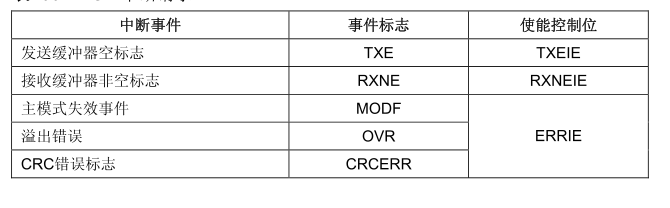
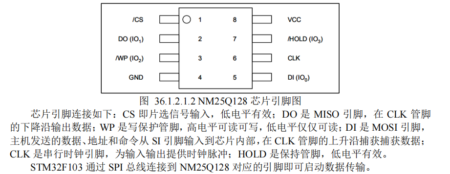
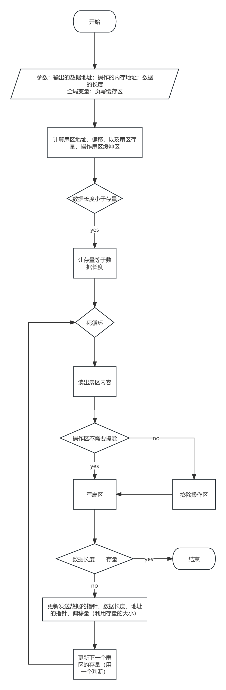

# SPI简介

Serial Peripheral interface 缩写，顾名思义就是串行外围设备接口。

高速、全双工、同步

主机：时钟信号提供者；通信发起者；从机选择者

从机：通信应答者；

## 框图


- SCK：串口时钟，作为主设备的输出与外界相连

- NSS：作为片选引脚，可以配置多种功能

  - 与特定设备通信
  - 主从模式的切换

  有两种模式：

  - 软件模式：可以复用NSS引脚，通过写SPI_CR1的SSI位来驱动
  - 硬件模式：
    - 输出使能，广播模式
    - 输出被关闭

## 工作模式

CPOL：时钟极性

CPHA：时钟相位（和IIC中数据传输的变化、读取不同）

1. 在改变CPOL和CPHA前，先清除SPE位将SPI禁止
2. SCK空闲状态要和CPOL相同

中断：



标志位：

- TXE
- RXNE
- BSY

## 寄存器

- 移位寄存器+数据寄存器：全双工模式的基础，通过两个寄存器对应位的数据交换实现全双工，交换完成的那一刻该发出的数据已经保留在移位寄存器，该接收的数据已经保留在接收寄存器

## NOR FLASH

可以按字节读写数据

由于有先擦再写的特性，操作FLASH时要根据其最小扇区配置缓冲区



### 工作时序（NM25Q128）

一般是先发送指令，再发送操作的地址，然后按照事先确定好的时序进行操作

# HAL驱动 

`stm32f1xx_hal_spi.c`

在 STM32 的 HAL 库中，SPI 驱动由一套结构体、宏定义和函数接口构成，便于初始化、发送接收、处理中断/DMA 等操作。以下是核心内容的系统梳理：

------

## 一、关键结构体

### 1. `SPI_HandleTypeDef`

SPI 操作的核心句柄结构体，定义在 `stm32f1xx_hal_spi.h` 中：

```c
typedef struct __SPI_HandleTypeDef
{
  SPI_TypeDef                 *Instance;    // SPI寄存器的基地址
  SPI_InitTypeDef             Init;         // 初始化结构体
  uint8_t                     *pTxBuffPtr;  // 发送缓冲区指针
  uint16_t                    TxXferSize;   // 发送数据量
  uint16_t                    TxXferCount;  // 已发送数据量
  uint8_t                     *pRxBuffPtr;  // 接收缓冲区指针
  uint16_t                    RxXferSize;   // 接收数据量
  uint16_t                    RxXferCount;  // 已接收数据量
  void                        (*RxISR)(struct __SPI_HandleTypeDef *hspi); // 中断接收函数指针
  void                        (*TxISR)(struct __SPI_HandleTypeDef *hspi); // 中断发送函数指针
  DMA_HandleTypeDef           *hdmatx;      // 发送 DMA 句柄
  DMA_HandleTypeDef           *hdmarx;      // 接收 DMA 句柄
  HAL_LockTypeDef             Lock;         // 锁状态
  __IO HAL_SPI_StateTypeDef   State;        // SPI 状态
  __IO uint32_t               ErrorCode;    // 错误代码
} SPI_HandleTypeDef;
```

### 2. `SPI_InitTypeDef`

用于配置 SPI 初始化参数的结构体：

```c
typedef struct
{
  uint32_t Mode;              // 主机或从机
  uint32_t Direction;         // 通信方向（全双工、单向等）
  uint32_t DataSize;          // 数据大小（8位、16位）
  uint32_t CLKPolarity;       // 时钟极性
  uint32_t CLKPhase;          // 时钟相位
  uint32_t NSS;               // NSS 信号管理
  uint32_t BaudRatePrescaler; // 波特率分频
  uint32_t FirstBit;          // 先发送高位还是低位
  uint32_t TIMode;            // TI 模式开关
  uint32_t CRCCalculation;    // CRC 计算开关
  uint32_t CRCPolynomial;     // CRC 多项式
} SPI_InitTypeDef;
```

------

## 二、常用宏定义

这些宏定义帮助设置 `SPI_InitTypeDef` 中的参数，常见的如下：

- **SPI 模式**：

```c
#define SPI_MODE_MASTER              ((uint32_t)0x00000004)
#define SPI_MODE_SLAVE               ((uint32_t)0x00000000)
```

- **数据传输方向**：

```c
#define SPI_DIRECTION_2LINES         ((uint32_t)0x00000000)
#define SPI_DIRECTION_2LINES_RXONLY  ((uint32_t)0x00000001)
#define SPI_DIRECTION_1LINE          ((uint32_t)0x00000002)
```

- **数据位宽**：

```c
#define SPI_DATASIZE_8BIT            ((uint32_t)0x00000000)
#define SPI_DATASIZE_16BIT           ((uint32_t)0x00000800)
```

- **NSS 信号控制**：

```c
#define SPI_NSS_SOFT                 ((uint32_t)0x00000200)
#define SPI_NSS_HARD_INPUT           ((uint32_t)0x00000000)
#define SPI_NSS_HARD_OUTPUT          ((uint32_t)0x00000400)
```

- **波特率分频**：

```c
#define SPI_BAUDRATEPRESCALER_2     ((uint32_t)0x00000000)
#define SPI_BAUDRATEPRESCALER_4     ((uint32_t)0x00000008)
#define SPI_BAUDRATEPRESCALER_8     ((uint32_t)0x00000010)
#define SPI_BAUDRATEPRESCALER_16    ((uint32_t)0x00000018)
// 一直到 PRESCALER_256
```

------

## 三、HAL 函数接口

### 1. 初始化相关

```c
HAL_StatusTypeDef HAL_SPI_Init(SPI_HandleTypeDef *hspi);
HAL_StatusTypeDef HAL_SPI_DeInit(SPI_HandleTypeDef *hspi);
void HAL_SPI_MspInit(SPI_HandleTypeDef *hspi);    // 用户实现
void HAL_SPI_MspDeInit(SPI_HandleTypeDef *hspi);  // 用户实现
```

### 2. 数据传输（阻塞）

```c
HAL_StatusTypeDef HAL_SPI_Transmit(SPI_HandleTypeDef *hspi, uint8_t *pData, uint16_t Size, uint32_t Timeout);
HAL_StatusTypeDef HAL_SPI_Receive(SPI_HandleTypeDef *hspi, uint8_t *pData, uint16_t Size, uint32_t Timeout);
HAL_StatusTypeDef HAL_SPI_TransmitReceive(SPI_HandleTypeDef *hspi, uint8_t *pTxData, uint8_t *pRxData, uint16_t Size, uint32_t Timeout);
```

### 3. 中断模式传输

```c
HAL_StatusTypeDef HAL_SPI_Transmit_IT(...);
HAL_StatusTypeDef HAL_SPI_Receive_IT(...);
HAL_StatusTypeDef HAL_SPI_TransmitReceive_IT(...);
```

### 4. DMA 模式传输

```c
HAL_StatusTypeDef HAL_SPI_Transmit_DMA(...);
HAL_StatusTypeDef HAL_SPI_Receive_DMA(...);
HAL_StatusTypeDef HAL_SPI_TransmitReceive_DMA(...);
```

### 5. 状态和控制

```c
HAL_SPI_StateTypeDef HAL_SPI_GetState(SPI_HandleTypeDef *hspi);
uint32_t HAL_SPI_GetError(SPI_HandleTypeDef *hspi);
```

------

# 外设

## NOR FLASH

| 对比项         | **NOR Flash**                    | **NAND Flash**                         |
| -------------- | -------------------------------- | -------------------------------------- |
| 结构           | 并行访问、地址线可随机访问       | 块访问、页访问                         |
| 读取速度       | 快（可直接执行代码，XIP）        | 慢（不适合直接执行，需要先复制到 RAM） |
| 写入和擦除速度 | 较慢                             | 更快                                   |
| 存储密度       | 低                               | 高（更小封装，便宜）                   |
| 可靠性         | 高，读写次数更低，数据更安全     | 稍低，需要纠错（ECC）                  |
| 常见用途       | 启动代码存储（Bootloader、固件） | 大容量数据存储（如 SD 卡、U盘、eMMC）  |

以NM25Q128为例

容量：16M，分为256个块，每个块有16个扇区，每个扇区大小4K，是最小擦除单位

引脚：关注WP（写保护管角）；HOLD管脚，暂时停止数据传输

**工作时序：**

- CPOL：1；CPHA：2
- 读操作：03H+24位地址，然后响应的数据就会发送
- 写操作：写使能+02H+24位地址+数据
- 擦除指令：
  - 擦除扇区后扇区位全置1，即FFh
  - 需要先拉低CS，写使能+20H+24位地址
  - 然后拉高CS，通过读取BSY判断扇区擦除是否完成

# 配置

1. 对单片机的spi参数进行配置
2. msp配置：时钟，GPIO；**补充一点硬件映射的知识，不需要在代码中特别指定时钟引脚，要根据电气特性图配置，并注意冲突**
3. 使能

# **操作实例**

## 以 `void norflash_write()` 为例

```c
/**
 * @brief       写SPI FLASH
 *   @note      在指定地址开始写入指定长度的数据 , 该函数带擦除操作!
 *              SPI FLASH 一般是: 256个字节为一个Page, 4Kbytes为一个Sector, 16个扇区为1个Block
 *              擦除的最小单位为Sector.
 *
 * @param       pbuf    : 数据存储区
 * @param       addr    : 开始写入的地址(最大32bit)
 * @param       datalen : 要写入的字节数(最大65535)
 * @retval      无
 */
uint8_t g_norflash_buf[4096];   /* 扇区缓存 */

void norflash_write(uint8_t *pbuf, uint32_t addr, uint16_t datalen)
{
    uint32_t secpos;
    uint16_t secoff;
    uint16_t secremain;
    uint16_t i;
    uint8_t *norflash_buf;

    norflash_buf = g_norflash_buf;
    secpos = addr / 4096;       /* 扇区地址 */
    secoff = addr % 4096;       /* 在扇区内的偏移 */
    secremain = 4096 - secoff;  /* 扇区剩余空间大小 */

    //printf("ad:%X,nb:%X\r\n", addr, datalen); /* 测试用 */
    if (datalen <= secremain)
    {
        secremain = datalen;    /* 不大于4096个字节 */
    }

    while (1)
    {
        norflash_read(norflash_buf, secpos * 4096, 4096);   /* 读出整个扇区的内容 */

        for (i = 0; i < secremain; i++)   /* 校验数据 */
        {
            if (norflash_buf[secoff + i] != 0XFF)
            {
                break;      /* 需要擦除, 直接退出for循环 */
            }
        }

        if (i < secremain)   /* 需要擦除 */
        {
            norflash_erase_sector(secpos);  /* 擦除这个扇区 */

            for (i = 0; i < secremain; i++)   /* 复制 */
            {
                norflash_buf[i + secoff] = pbuf[i];
            }

            norflash_write_nocheck(norflash_buf, secpos * 4096, 4096);  /* 写入整个扇区 */
        }
        else        /* 写已经擦除了的,直接写入扇区剩余区间. */
        {
            norflash_write_nocheck(pbuf, addr, secremain);  /* 直接写扇区 */
        }

        if (datalen == secremain)
        {
            break;  /* 写入结束了 */
        }
        else        /* 写入未结束 */
        {
            secpos++;               /* 扇区地址增1 */
            secoff = 0;             /* 偏移位置为0 */

            pbuf += secremain;      /* 指针偏移 */
            addr += secremain;      /* 写地址偏移 */
            datalen -= secremain;   /* 字节数递减 */

            if (datalen > 4096)
            {
                secremain = 4096;   /* 下一个扇区还是写不完 */
            }
            else
            {
                secremain = datalen;/* 下一个扇区可以写完了 */
            }
        }
    }
}
```




