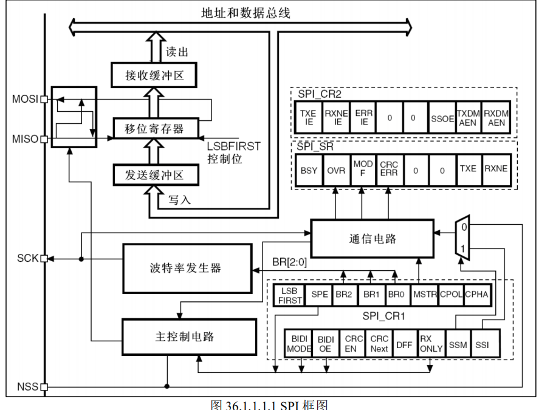

# SPI简介

Serial Peripheral interface 缩写，顾名思义就是串行外围设备接口。

高速、全双工、同步

主机：时钟信号提供者；通信发起者；从机选择者

从机：通信应答者；

## 框图



工作原理：主机和从机都有一个串行移位寄存器；外设的写操作和读操作强同步

传输方法：全双工；半双工；单工

## 工作模式

CPOL：时钟极性

CPHA：时钟相位（和IIC中数据传输的变化、读取不同）

## 寄存器

- DR：实际上是一个寄存器组

## NOR FLASH

可以按字节读写数据

由于有先擦再写的特性，操作FLASH时要根据其最小扇区配置缓冲区


### 工作时序（NM25Q128）

一般是先发送指令，再发送操作的地址，然后按照事先确定好的时序进行操作

## HAL驱动 

`stm32f1xx_hal_spi.c`

- `HAL_StatusTypeDef HAL_SPI_Init(SPI_HandleTypeDef *hspi);`

形参是句柄结构体指针，其中的成员重点关注通信初始化结构体类型 `SPI_InitTypeDef`

```c
typedef struct
{
 uint32_t Mode; /* 模式：主:SPI_MODE_MASTER 从:SPI_MODE_SLAVE */
 uint32_t Direction; /* 方向： 只接收模式 单线双向通信数据模式 全双工 */
 uint32_t DataSize; /* 数据帧格式： 8 位/16 位 */
 uint32_t CLKPolarity; /* 时钟极性 CPOL 高/低电平 */
 uint32_t CLKPhase; /* 时钟相位 奇/偶数边沿采集 */
 uint32_t NSS; /* SS 信号由硬件（NSS）管脚控制还是软件控制 */
 uint32_t BaudRatePrescaler; /* 设置 SPI 波特率预分频值*/
 uint32_t FirstBit; /* 起始位是 MSB 还是 LSB */
 uint32_t TIMode; /* 帧格式 SPI motorola 模式还是 TI 模式 */
 uint32_t CRCCalculation; /* 硬件 CRC 是否使能 */
 uint32_t CRCPolynomial; /* 设置 CRC 多项式*/
} SPI_InitTypeDef;
```


